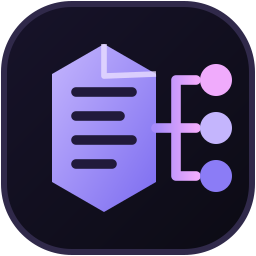

<div align="center">
  
  <h1>zymposium</h1>
  <p><strong>Agent skills for Zig projects and CLI tools</strong>:
     your packages declare skills in <code>skills/</code>, and zymposium links them into
     the agent directories you actually use.</p>
  <p>
    <a href="https://github.com/JustinWoodring/zymposium/actions/workflows/ci.yml"></a>
    <a href="LICENSE"></a>
    
    <a href="https://github.com/JustinWoodring/zymposium/releases"></a>
    <a href="https://github.com/JustinWoodring/zymposium/pulls"></a>
    <a href="https://github.com/sponsors/JustinWoodring"></a>
  </p>
  <p><a href="https://justinwoodring.github.io/zymposium">justinwoodring.github.io/zymposium</a></p>
  <p><em>I’m building a small ecosystem of focused Zig tools: zest builds and updates
     CLI tools; zymposium provisions the agent skills those tools and Zig packages
     provide. Each works on its own; the integration is optional.</em></p>
</div>

---

## Quick start

The recommended install is one command, via
[zest](https://github.com/JustinWoodring/zest):

```sh
zest install JustinWoodring/zymposium
```

zymposium is built, versioned, and upgraded like any other zest tool — with
`zest update zymposium` — and it re-syncs agent skills whenever zest installs,
updates, or removes a tool that ships them.

**Prefer to build it yourself?** zymposium is a single self-contained binary
with no dependencies beyond Zig and `git`, and it works perfectly well on its
own:

```sh
git clone https://github.com/JustinWoodring/zymposium
cd zymposium
zig build -Doptimize=ReleaseSafe
./zig-out/bin/zymposium init
```

Without zest you still get project dependency skills and `zymposium add`; see
[Running without zest](#running-without-zest) for exactly what changes.

Either way:

```sh
zymposium sync      # discover skills and link them into your agents
zymposium list      # what is provisioned, and where each one came from
```

## What is zymposium?

An agent only knows about a skill if the skill is sitting in a directory that
agent looks in. For a Zig toolchain that means `~/.claude/skills` and friends,
and keeping those in sync with the tools and libraries you have installed is
manual busywork that nobody does. zymposium does it.

With [zest](https://github.com/JustinWoodring/zest) installed — the recommended
route — a tool's skills join automatically and refresh whenever you update the
tool:

```sh
zest install github.com/user/my-cli-tool    # tool ships skills/tool-usage/
#   ~/.claude/skills/my-cli-tool/tool-usage -> <zest clone>/skills/tool-usage
```

Inside a Zig project, the same command also covers that project's dependency
chain, globally and project-locally:

```sh
zymposium sync
#   <project>/.claude/skills/lib/lib-usage -> <dep>/skills/lib-usage
#   ~/.claude/skills/lib/lib-usage         -> <dep>/skills/lib-usage
```

This is the same idea as Rust's [Symposium](https://symposium.dev), brought to
Zig.

## Authoring a skill

A skill is a directory under `<package-root>/skills` containing a `SKILL.md`:

```
my-tool/
├── build.zig
├── build.zig.zon
└── skills/
    └── my-tool-usage/
        ├── SKILL.md
        └── reference.md      # optional extra files
```

```markdown
---
name: my-tool-usage
description: How to drive my-tool correctly
---

Run `my-tool --help` before passing flags.
```

The directory name is the skill's identity — that is the name the agent sees.
`name` and `description` in the frontmatter are shown by `zymposium list`; the
`description` is what an agent reads to decide whether to open the skill, so
write it for that purpose.

Add `skills` to your package's `build.zig.zon` `.paths` so it survives `zig fetch`.

## Where skills come from

Three sources, in the order they are considered:

1. **zest tools.** Every tool in [zest](https://github.com/JustinWoodring/zest)'s
   install manifest whose staged clone has a `skills/` directory. zymposium
   reads zest's `state.json`, so this costs nothing and never touches the
   network.
2. **Project dependencies.** Run inside a Zig project, zymposium walks the
   `build.zig.zon` dependency graph — transitively, cycle-safe, depth-limited —
   and fetches each git dependency into its own cache. This is where most of
   the ecosystem's skills live, in libraries rather than applications.
3. **Added packages.** `zymposium add <path|url>` manages a package outside both
   zest and any project.

Non-git dependencies (plain tarball URLs) are reported and skipped; only git
dependencies can supply skills.

Only the **first** source needs zest. The other two work with no tool manager
installed at all — see [Running without zest](#running-without-zest).

Run `zymposium sources` to see what is available before provisioning it.

## Linking

Skills are **linked**, not copied, so `zest update` refreshes every agent at
once with no extra work. When the filesystem refuses a symlink — Windows without
developer mode, FAT/exFAT — zymposium falls back to a real copy automatically.
Set `link_mode` in the config to `symlink` or `copy` to pin the behaviour.

**zymposium only ever deletes a path recorded in its own manifest.** A skill you
wrote by hand, sitting beside a provisioned one, survives every sync. If you
replace a provisioned symlink with your own directory, zymposium reports a
conflict and leaves your files alone; `--force` takes it over.

Skill install paths are namespaced by provider, so two packages may safely ship
the same skill name: `~/.claude/skills/<provider>/<skill>/`. If a user file
already occupies that exact path, zymposium reports a conflict and leaves it
alone; `--force` takes it over.

## Commands

```
zymposium init                       Write a default config and prepare the layout
zymposium sync [options]             Provision skills from every source
                                     --tool <name>   only this provider (used by zest)
                                     --project <dir> project root to scope against
                                     --force         take over paths zymposium does not own
                                     --no-lazy       skip .lazy dependencies
                                     --offline       never fetch; use only what is cached
                                     --json          machine-readable result
zymposium list [--json]              Show provisioned skills and where they came from
zymposium sources [--json]           Show packages that ship skills
zymposium add <path|url> [--name]    Add a package's skills directly
zymposium remove <provider/skill>      Unlink a provisioned skill (bare name if unique)
zymposium update [provider/skill]      Re-fetch source and re-sync (bare name if unique)
zymposium doctor [--json]            Check provisioned links against the filesystem
zymposium agents                     List known agents and their skill directories
```

`list` is the command that answers "where did this skill come from and how do I
update it":

```
SKILL          PROVIDER  VERSION  AGENTS              DESCRIPTION
zm-tool-usage  zm-tool   v1.4.0   claude,codex,agent  How to drive zm-tool correctly

zm-tool-usage (zest_tool):
  from    https://github.com/example/my-tool
  update  zymposium update zm-tool/zm-tool-usage
  link    claude ~/.claude/skills/zm-tool/zm-tool-usage (global)
```

## Skills for zest and zymposium

Each tool owns its own skill source:

```
zymposium repo                         zest repo
skills/                                skills/
└── zymposium/                         └── zest/
    └── SKILL.md                           └── SKILL.md
```

On installation, zymposium namespaces every skill by provider **and** skill
name. The two install locations are distinct even though each skill has the
same name as its provider:

```
~/.claude/skills/zymposium/zymposium/   <- zymposium's own skill
~/.claude/skills/zest/zest/             <- zest's own skill
```

zymposium finds its own source by walking up from its executable to the nearest
`build.zig.zon`, so this works with a plain `zig build` too. It finds zest's
source in zest's staged self-update clone at `<XDG_DATA_HOME>/zest/self/src`.
If zest is not installed, the zest skill is simply absent; zymposium's own
skills and project skills still work.

## Running without zest

**zymposium works on its own.** zest is an optional companion, not a dependency.
With nothing but zymposium installed you still get:

- the full transitive `build.zig.zon` dependency chain, path and git alike;
- skills linked into every configured agent boundary, global and project-local;
- provenance in `list`, verification in `doctor`, and `zymposium add`.

What you lose is exactly one source: **skills belonging to installed CLI
tools**. That one is inherently zest-dependent, because there is no manifest of
installed tools without a tool manager to keep one. So the source list without
zest reduces to:

```
project dependencies  +  zymposium add
```

With [zest](https://github.com/JustinWoodring/zest) installed you get a third:

```
zest tools  +  project dependencies  +  zymposium add
```

where `zest tools` is refreshed for free whenever you `zest update` the tool,
because the skill is a symlink into the clone zest already manages.

## Supported agents

| id | agent | global | project |
| --- | --- | --- | --- |
| `claude` | Claude Code | `~/.claude/skills` | `<project>/.claude/skills` |
| `codex` | Codex (OpenAI) | `~/.codex/skills` | `<project>/.codex/skills` |
| `agent` | Generic `.agent` | `~/.agent/skills` | `<project>/.agent/skills` |

Run `zymposium agents` for the registry your build knows about.

## Configuration

`$XDG_CONFIG_HOME/zymposium/config.json` (default `~/.config/zymposium`):

```json
{
  "version": 1,
  "agents": ["claude", "codex", "agent"],
  "link_mode": "auto",
  "scope": "both"
}
```

| field | values | meaning |
| --- | --- | --- |
| `agents` | `claude`, `codex`, `agent` | which agent boundaries to provision |
| `link_mode` | `auto`, `symlink`, `copy` | how skills are materialized |
| `scope` | `global`, `project`, `both` | `~/.claude/skills`, `<project>/.claude/skills`, or both |

An unknown agent id is an error rather than a silent no-op, so a typo cannot
quietly provision nothing. `zymposium init` writes this file and creates the
global skill directories.

## Layout

```
$XDG_DATA_HOME/zymposium/          (default ~/.local/share/zymposium)
├── state.json                     what is provisioned, and its provenance
├── packages.json                  packages added with `zymposium add`
├── deps/                          clones of project dependencies
└── pkgs/                          clones of added packages
```

`state.json` is the record of what zymposium owns. It is the reason pruning is
safe: nothing is deleted that is not written there.

## Relationship to zest

zymposium and [zest](https://github.com/JustinWoodring/zest) are separate tools
that cooperate, and **the coupling is optional in both directions**:

- zest does not depend on zymposium. It works exactly as before with nothing
  installed.
- zymposium does not need zest. Without it, skills still come from project
  dependencies and `zymposium add`.

When both are installed, zest re-syncs the affected tool's skills after every
install, update, and remove:

```
zest install my-tool   →  zymposium sync --tool my-tool
zest update  my-tool   →  zymposium sync --tool my-tool
zest remove  my-tool   →  zymposium sync --tool my-tool
```

The hook is advisory. If zymposium is missing or fails, zest says so and still
reports the install or update as successful — managing skills must never break
managing binaries.

A `--tool` run only touches that provider's skills, so it never disturbs skills
belonging to other tools. A full `zymposium sync` is responsible for everything,
which is why it prunes links whose tool or dependency has disappeared.

zest resolves zymposium from its own `bin` directory. Set `ZYMPOSIUM_BIN` to
point at a binary kept elsewhere.

## Acknowledgements

The dependency-aware agent-skills idea was inspired by
[Symposium](https://github.com/symposium-dev/symposium), which matches agent
extensions to Rust workspace dependencies. zymposium adapts that idea to Zig
packages and zest-managed tools.

## Exit codes

| code | meaning |
| --- | --- |
| 0 | success |
| 1 | a user-owned path conflict, or `doctor` found problems |
| 2 | invalid usage |

`--json` is available on `sync`, `list`, `sources`, and `doctor` for scripting.

## Development

```sh
zig build                  # build
zig build test             # run the unit tests
zig fmt --check src build.zig
./scripts/mock-e2e.sh      # hermetic end-to-end suite (no network)
```

See [CONTRIBUTING.md](CONTRIBUTING.md), and
[CONTRIBUTORS](CONTRIBUTORS) for who works on it.

## License

[MIT](LICENSE)
